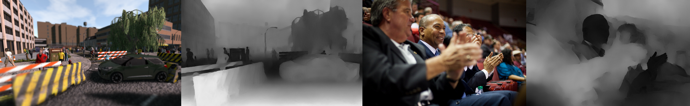

## DMENet &mdash; Official TensorFlow Implementation



**Picture:** *Outputs generated from our network &ndash; from left to right, synthetic input, defocus map output, real input and its defocus map output.*

This repository contains the official TensorFlow implementation of the following paper:

> **Deep Defocus Map Estimation using Domain Adaptation**<br>
> Junyong Lee (POSTECH), Sungkil Lee (Sungkyunkwan University), Sunghyun Cho (POSTECH) Seungyong Lee (POSTECH)
> 
> http://cg.postech.ac.kr/papers/2019_CVPR_JY.pdf
>
> **Abstract:** *In this paper, we propose the first end-to-end convolutional neural network (CNN) architecture, Defocus Map Estimation Network (DMENet), for spatially varying defocus map estimation. To train the network, we produce a novel depth-of-field (DOF) dataset, SYNDOF, where each image is synthetically blurred with a ground-truth depth map. Due to the synthetic nature of SYNDOF, the feature characteristics of images in SYNDOF can differ from those of real defocused photos. To address this gap, we use domain adaptation that transfers the features of real defocused photos into those of synthetically blurred ones. Our DMENet consists of four subnetworks: blur estimation, domain adaptation, content preservation, and sharpness calibration networks. The subnetworks are connected to each other and jointly trained with their corresponding supervisions in an end-toend manner. Our method is evaluated on publicly available blur detection and blur estimation datasets and the results show the state-of-the-art performance.*

For any inquiries, please contact [junyonglee@postech.ac.kr](mailto:junyonglee@postech.ac.kr)

## Resources

All material related to our paper is available via the following links:

| Link |
| :-------------- |
| [Paper PDF](https://drive.google.com/open?id=1wmauOTscwrVs38NR2JfO4Xopt3isqiWT) |
| [Supplementary Files](https://drive.google.com/drive/folders/17QECZR4YNOjJO7QrIHcK7MGkwG6t8UaB?usp=sharing) |
| [Checkpoint Files](https://drive.google.com/open?id=19QPL2shfBRRZsYaJ1Gokv8NdogKHOVH0) |
| [Datasets](https://www.dropbox.com/s/s6ehxpvu9xxu9w8/datasets.zip?dl=0)|

## Preparing datasets for training
Frist, download the dataset from [here](https://www.dropbox.com/s/s6ehxpvu9xxu9w8/datasets.zip?dl=0).
Initially, datasets should be placed in `./datasets` where each testing and training are separated as `./datasets/test` or `./datasets/train` (one may change the offset in `config.py`).

## Preparing pretrained VGG19 for training
We need pretrained weights of VGG18 for the encoder part of DMENet. Download pretrained VGG19 checkpoint file from [here](https://www.dropbox.com/s/7ah1jwrmggog4q9/vgg19.zip?dl=0).

## Training/Testing the network
To train the network, type
```bash
python main.py --is_train True --mode DMENet_BDCS
```
To test the network, type
```bash
python main.py --is_train False --mode DMENet_BDCS
```
Modify config.py for other options, such as
```bash
--is_pretrain : ([True/False], pretrain the network with MSE loss first)
--delete_log : ([True/False], deletes logs such as checkpoint, summaries before training begins)
```

## Using pre-trained networks
Download pretrained weights for DMENet from [here](https://www.dropbox.com/s/p1xlr5jgj7oemt1/DMENet_BDCS.zip?dl=0).
Place the file under `./logs/DMENet_BDCS/checkpoint` (one may change the offset in `./config.py`).
Then, run the network by typing,
```bash
python main.py --is_train False --mode DMENet_BDCS
```
*Please note that due to server issue, checkpoint file used for the paper is lost.
The provided checkpoint file is the new checkpoint that shows the closest evaluation results as the checkpoint used in the paper.*

## BIBTEX
If you find this code useful, please consider citing:

```
@InProceedings{Lee_2019_CVPR,
author = {Lee, Junyong and Lee, Sungkil and Cho, Sunghyun and Lee, Seungyong},
title = {Deep Defocus Map Estimation Using Domain Adaptation},
booktitle = {The IEEE Conference on Computer Vision and Pattern Recognition (CVPR)},
month = {June},
year = {2019}
}
```

## License ##
This software is being made available under the terms in the [LICENSE](LICENSE) file.

Any exemptions to these terms requires a license from the Pohang University of Science and Technology.

## About Coupe Project ##
Project ‘COUPE’ aims to develop software that evaluates and improves the quality of images and videos based on big visual data. To achieve the goal, we extract sharpness, color, composition features from images and develop technologies for restoring and improving by using it. In addition,ersonalization technology through userreference analysis is under study.  
    
Please checkout out other Coupe repositories in our [Posgraph](https://github.com/posgraph) github organization.

## Useful Links ##
* [Coupe Library](http://coupe.postech.ac.kr/)
* [POSTECH CG Lab.](http://cg.postech.ac.kr/)
